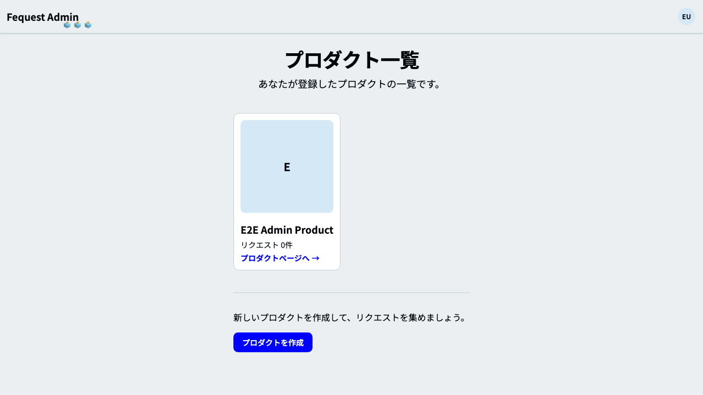
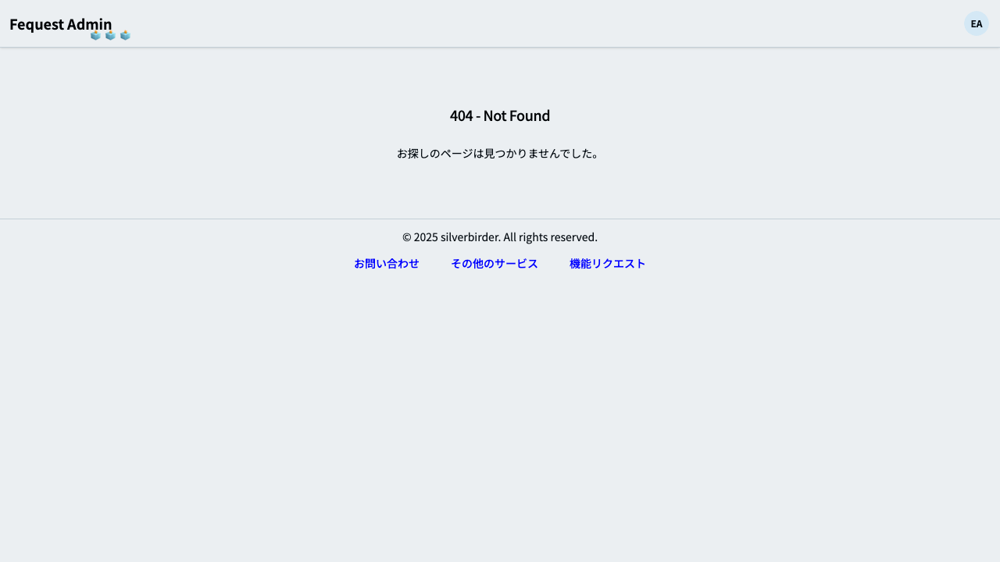

# フィーチャ: 管理画面のプロダクト管理を E2E で検証する

## シナリオ: 管理画面のトップページには自身が登録したプロダクトが一覧で見える

- 前提 admin アプリのコンテナを起動している
- かつ 検証用プロダクトが管理画面に登録済みである
- もし 管理画面のトップページを開いたとき
- ならば 登録したプロダクトが一覧に表示される
- かつ Playwright で管理画面の "admin-product-list.png" のスクリーンショットを保存できる

## シナリオ: 自身が登録していないプロダクトの管理画面ページは404である

- 前提 admin アプリのコンテナを起動している
- かつ 管理画面に他ユーザーのプロダクトが存在する
- もし 他ユーザーのプロダクト管理ページを開いたとき
- ならば 管理画面で404が表示される
- かつ Playwright で管理画面の "admin-product-not-found.png" のスクリーンショットを保存できる

## シナリオ: 管理画面でプロダクトを削除すると管理画面・ユーザー画面で閲覧できない

- 前提 admin と user アプリのコンテナを起動済みである
- かつ 検証用プロダクトが管理画面に登録済みである
- もし 管理画面でプロダクトを削除する
- ならば 管理画面で当該プロダクトページが404になる
- かつ ユーザー画面で当該プロダクトページが404になる
- かつ Playwright で管理画面の "admin-product-delete.png" のスクリーンショットを保存できる
