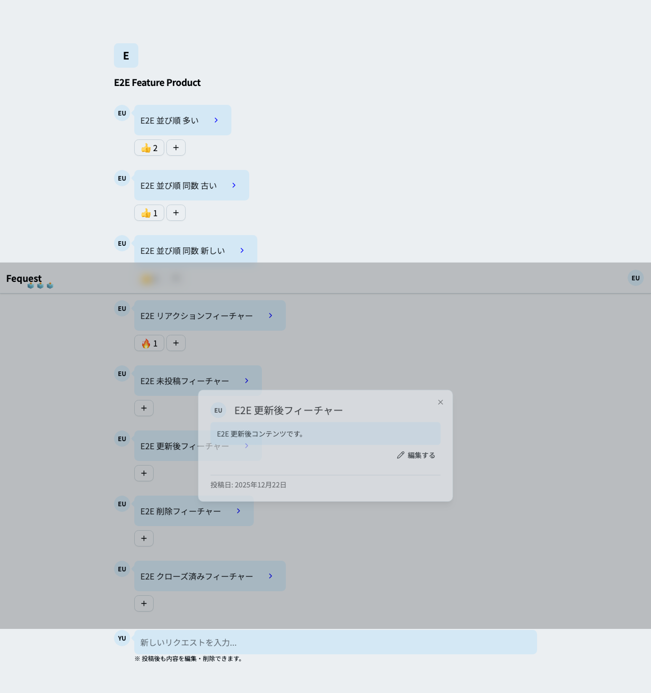
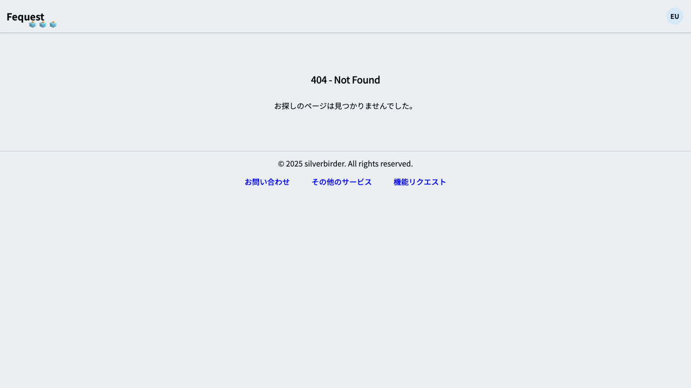
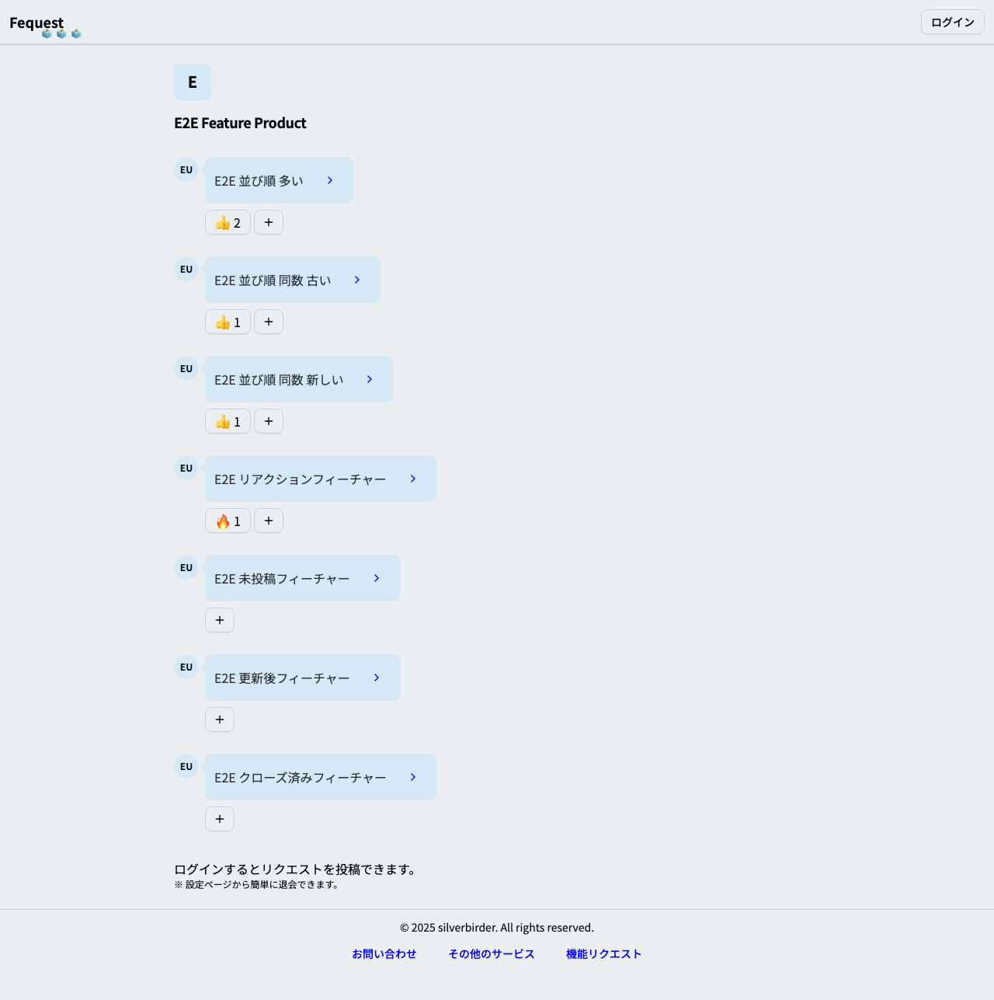
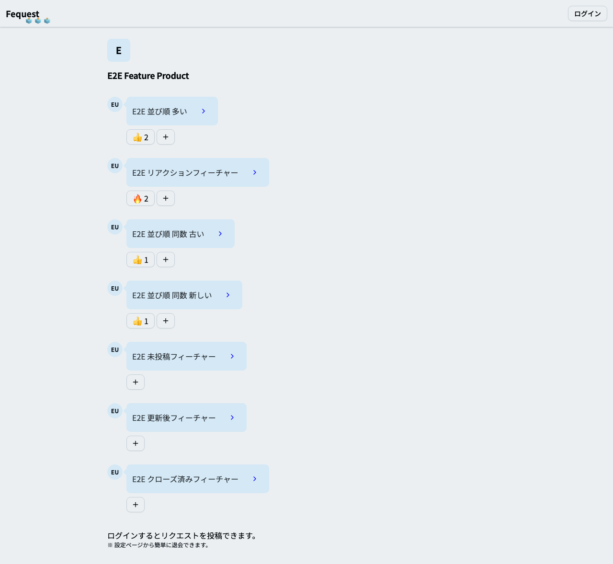

# フィーチャ: フィーチャーリクエストを E2E で検証する

## シナリオ: 自身が投稿していないフィーチャーには編集ボタンがなく編集ページは404である

- 前提 admin と user アプリのコンテナを起動している
- かつ 検証用のプロダクトとフィーチャーが用意されている
- かつ 別ユーザーの認証済みセッションが存在する
- もし 他ユーザーとしてプロダクトページを開いたとき
- ならば 他ユーザーが投稿していないフィーチャーに編集ボタンが表示されない
- かつ 当該フィーチャーの編集ページは404である
- かつ Playwright で "feature-request-non-owner.png" のスクリーンショットを保存できる

## シナリオ: 自身が投稿したフィーチャーの編集内容が反映される

- 前提 admin と user アプリのコンテナを起動している
- かつ 検証用のプロダクトとフィーチャーが用意されている
- かつ 認証済みユーザーのセッションが存在する
- もし 自身のフィーチャーの編集ページでタイトルと内容を更新する
- ならば 更新したタイトルと内容がプロダクトページに反映される
- かつ 自身のフィーチャーには編集ボタンが表示される
- かつ Playwright で "feature-request-edit.png" のスクリーンショットを保存できる

## シナリオ: 自身が投稿したフィーチャーを削除できる

- 前提 admin と user アプリのコンテナを起動している
- かつ 検証用のプロダクトとフィーチャーが用意されている
- かつ 認証済みユーザーのセッションが存在する
- もし 自身のフィーチャーを削除する
- ならば 削除したフィーチャーが一覧に表示されない
- かつ 削除したフィーチャーの編集ページは404である
- かつ Playwright で "feature-request-delete.png" のスクリーンショットを保存できる

## シナリオ: フィーチャーの並び順は絵文字数が多いもの、同数の場合は古いもの順である

- 前提 admin と user アプリのコンテナを起動している
- かつ 検証用のプロダクトとフィーチャーが用意されている
- もし 検証用プロダクトページを開いたとき
- ならば フィーチャーが絵文字数と作成日時の順で表示される
- かつ Playwright で "feature-request-order.png" のスクリーンショットを保存できる

## シナリオ: 管理画面でクローズしたフィーチャーは一覧の下で完了となっている

- 前提 admin と user アプリのコンテナを起動している
- かつ 検証用のプロダクトとフィーチャーが用意されている
- かつ クローズ済みフィーチャーが存在する
- もし 検証用プロダクトページを開いたとき
- ならば クローズ済みフィーチャーが一覧の下にあり完了となっている
- かつ Playwright で "feature-request-closed.png" のスクリーンショットを保存できる

## シナリオ: フィーチャーに絵文字リアクションができる

- 前提 admin と user アプリのコンテナを起動している
- かつ 検証用のプロダクトとフィーチャーが用意されている
- もし フィーチャーに絵文字リアクションを追加する
- ならば リアクション数が増える
- かつ Playwright で "feature-request-reaction.png" のスクリーンショットを保存できる
