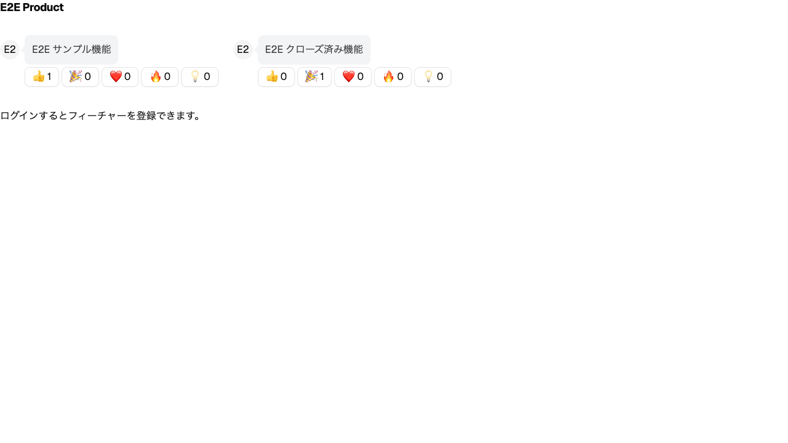

# Feature: プロダクト詳細ページを E2E で検証する

## Scenario: 管理画面で登録したプロダクト詳細をユーザーが閲覧できる

1. Given admin アプリケーションのコンテナを起動している
1. And user アプリケーションのコンテナを起動している
1. And 管理画面からサンプルのプロダクトが登録されている
1. When /[id] ページにアクセスしたとき
1. Then 登録したフィーチャーを確認できる
1. And Playwright で /[id] ページにアクセスしてスクリーンショットを保存できる

## Scenario: 認証したユーザーがフィーチャーリクエストを投稿する

1. Given admin アプリケーションのコンテナを起動している
1. And user アプリケーションのコンテナを起動している
1. And 管理画面からサンプルのプロダクトが登録されている
1. And 認証済みのユーザーセッションが存在する
1. When 認証ユーザーとして /[id] ページで "E2E 新規フィーチャー" を投稿する
1. Then 投稿したフィーチャーリクエストが一覧に表示される
