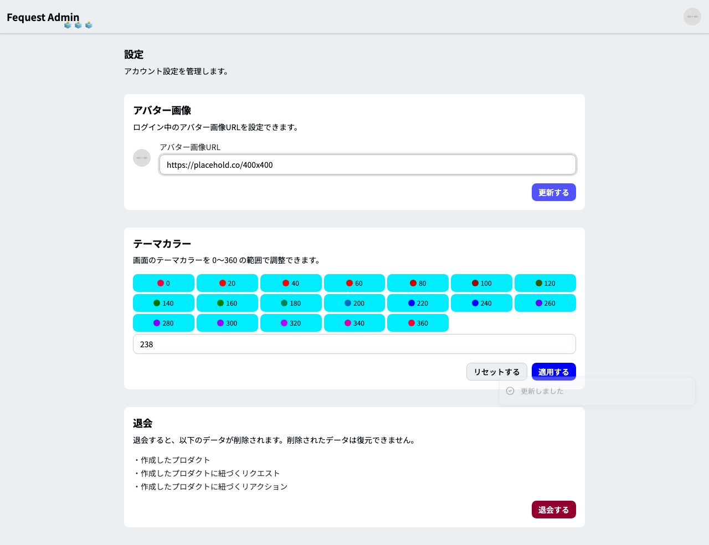
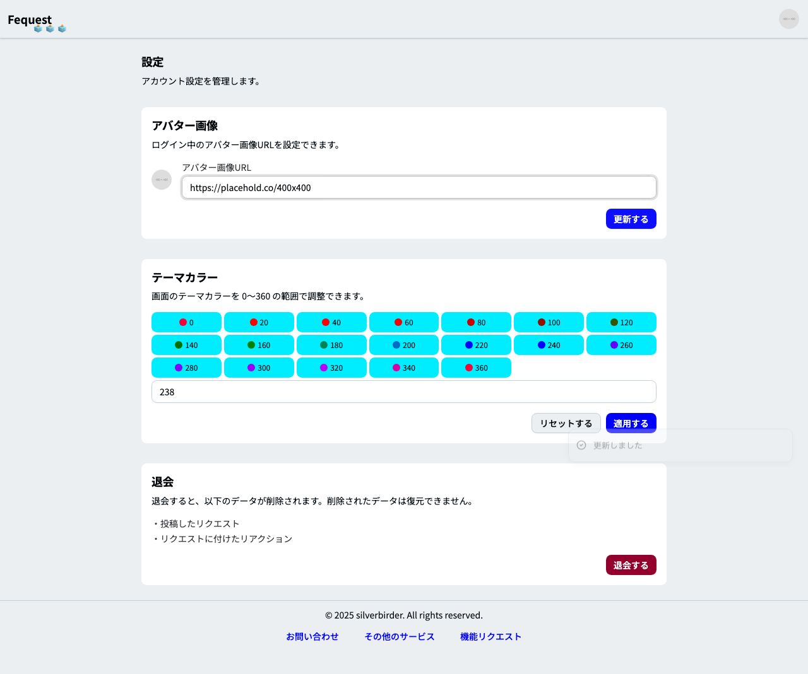

# フィーチャ: 設定ページでアバター画像を更新できる

## シナリオ: 管理者がアバター画像を更新できる

- 前提 アバター画像用に管理者とユーザーのアプリのコンテナを起動している
- かつ アバター画像用に管理者の認証済みセッションが存在する
- もし 管理画面の設定ページでアバター画像を更新する
- ならば 管理画面のアバター画像が更新されている
- かつ Playwright でアバター画像更新後の管理画面 "setting-avatar-admin.png" のスクリーンショットを保存できる

## シナリオ: ユーザーがアバター画像を更新できる

- 前提 アバター画像用に管理者とユーザーのアプリのコンテナを起動している
- かつ アバター画像用にユーザーの認証済みセッションが存在する
- もし ユーザー設定ページでアバター画像を更新する
- ならば ユーザー画面のアバター画像が更新されている
- かつ Playwright でアバター画像更新後のユーザー画面 "setting-avatar-user.png" のスクリーンショットを保存できる
