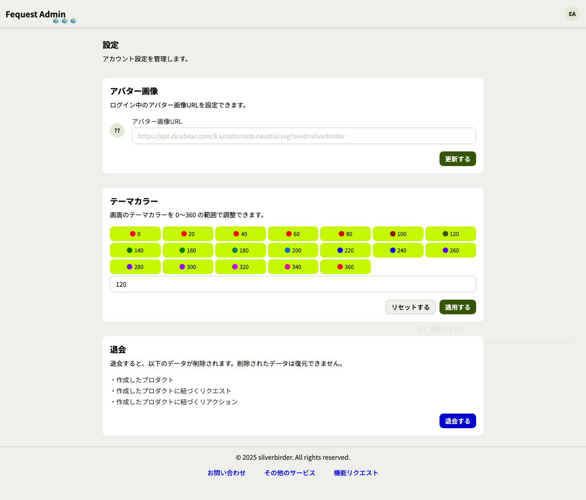
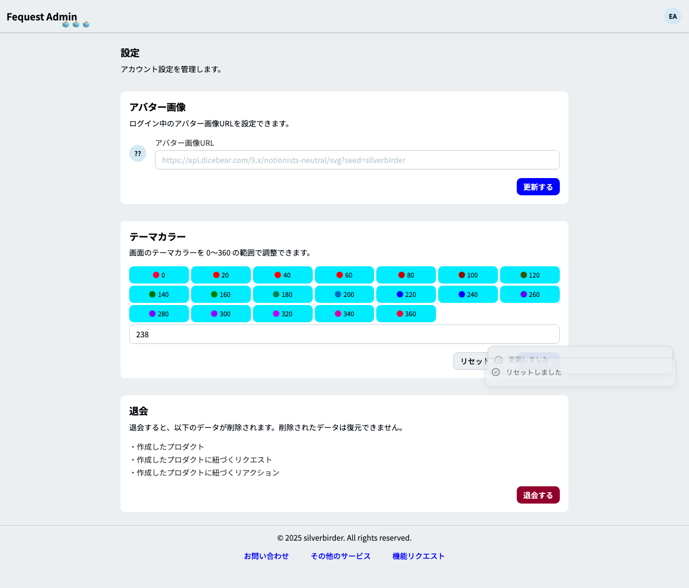
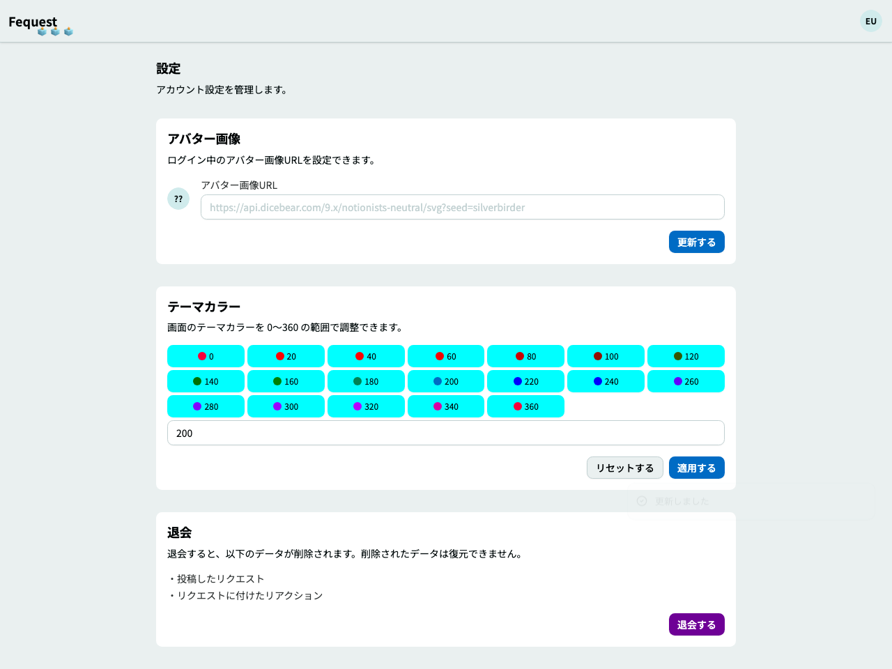
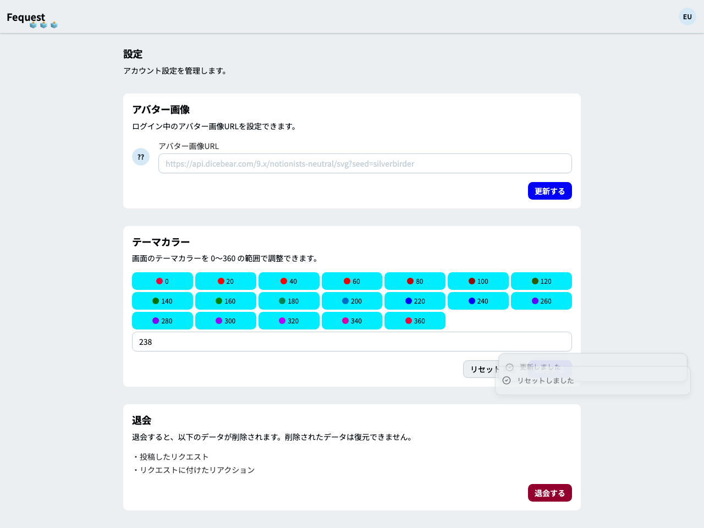

# フィーチャ: 設定ページでテーマカラーを変更できる

## シナリオ: 管理者がテーマカラーを適用・リセットできる

- 前提 テーマカラー用に管理者とユーザーのアプリのコンテナを起動している
- かつ テーマカラー用に管理者の認証済みセッションが存在する
- もし 管理画面の設定ページでテーマカラーを適用する
- かつ テーマカラー適用後の管理画面 "setting-theme-admin-applied.png" のスクリーンショットを保存できる
- ならば 管理者のテーマカラー cookie が保存されている
- もし 管理画面の設定ページでテーマカラーをリセットする
- ならば 管理者のテーマカラー cookie が削除されている
- かつ Playwright でテーマカラーの設定画面 "setting-theme-admin.png" のスクリーンショットを保存できる

## シナリオ: ユーザーがテーマカラーを適用・リセットできる

- 前提 テーマカラー用に管理者とユーザーのアプリのコンテナを起動している
- かつ テーマカラー用にユーザーの認証済みセッションが存在する
- もし ユーザー設定ページでテーマカラーを適用する
- かつ テーマカラー適用後のユーザー画面 "setting-theme-user-applied.png" のスクリーンショットを保存できる
- ならば ユーザーのテーマカラー cookie が保存されている
- もし ユーザー設定ページでテーマカラーをリセットする
- ならば ユーザーのテーマカラー cookie が削除されている
- かつ Playwright でテーマカラーのユーザー画面 "setting-theme-user.png" のスクリーンショットを保存できる
