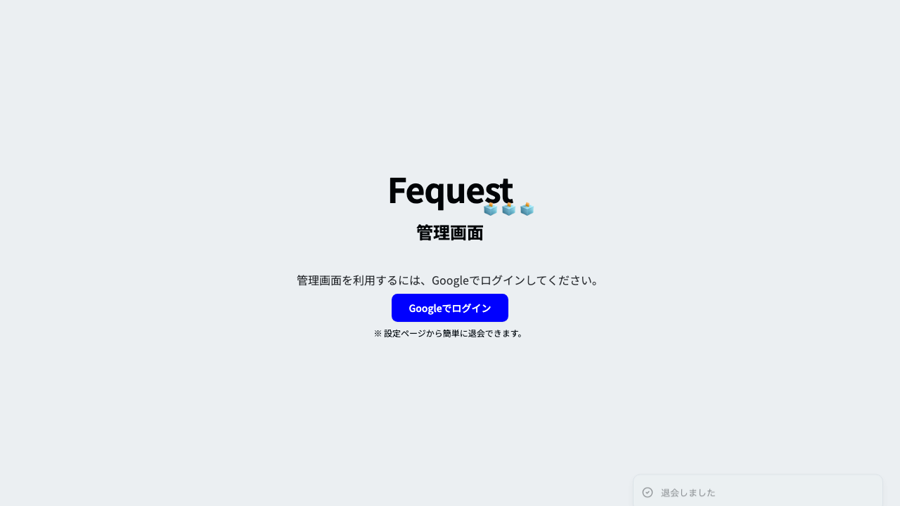
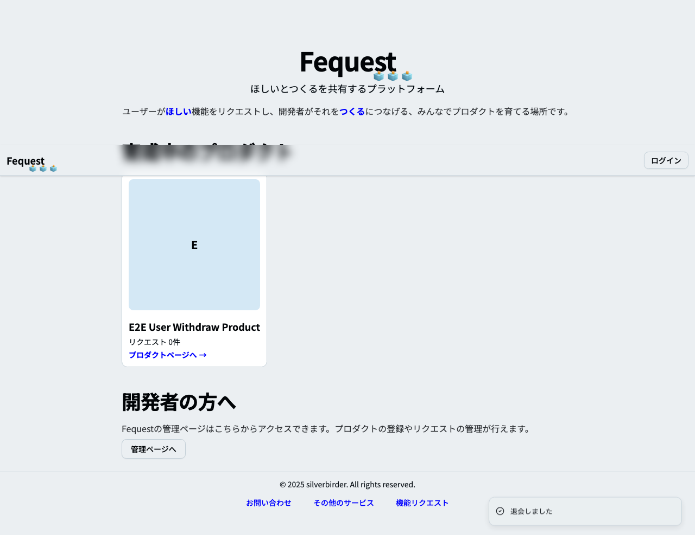

# フィーチャ: 退会後のデータ削除を E2E で検証する

## シナリオ: 管理者が退会するとプロダクトとフィーチャーのデータが削除される

- 前提 管理者とユーザーのアプリのコンテナを起動している
- かつ 管理者の検証用プロダクトとフィーチャーが用意されている
- かつ 管理者の認証済みセッションが存在する
- もし 管理画面の設定ページで退会する
- ならば 管理者のプロダクトとフィーチャーがデータベースに存在しない
- かつ 管理者のユーザー情報がデータベースに存在しない
- かつ Playwright で設定画面の "setting-withdraw-admin.png" のスクリーンショットを保存できる

## シナリオ: ユーザーが退会するとフィーチャーとリアクションのデータが削除される

- 前提 管理者とユーザーのアプリのコンテナを起動している
- かつ ユーザーの検証用フィーチャーとリアクションが用意されている
- かつ ユーザーの認証済みセッションが存在する
- もし ユーザー設定ページで退会する
- ならば ユーザーのフィーチャーとリアクションがデータベースに存在しない
- かつ ユーザーのユーザー情報がデータベースに存在しない
- かつ Playwright でユーザー画面の "setting-withdraw-user.png" のスクリーンショットを保存できる
